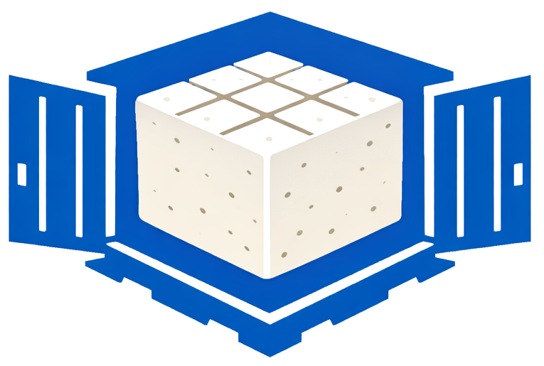
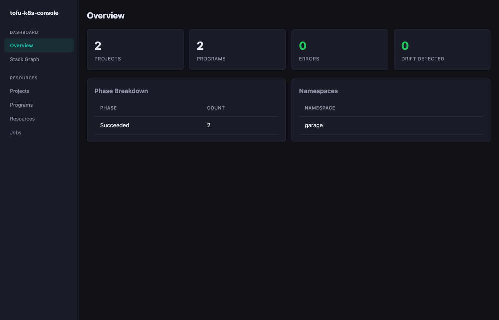
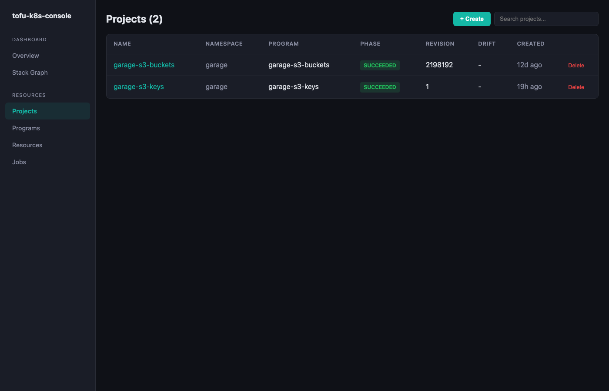
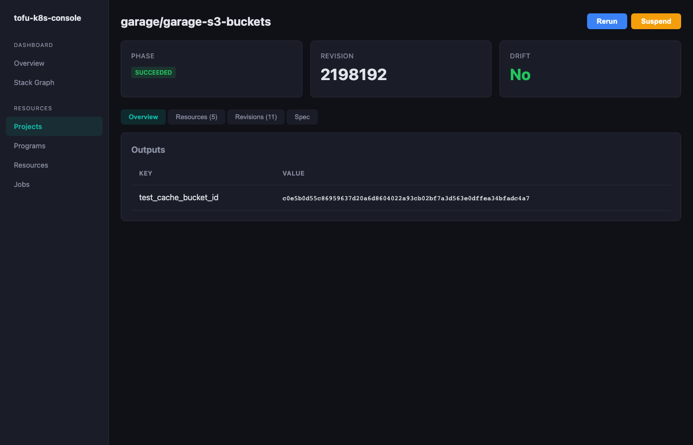
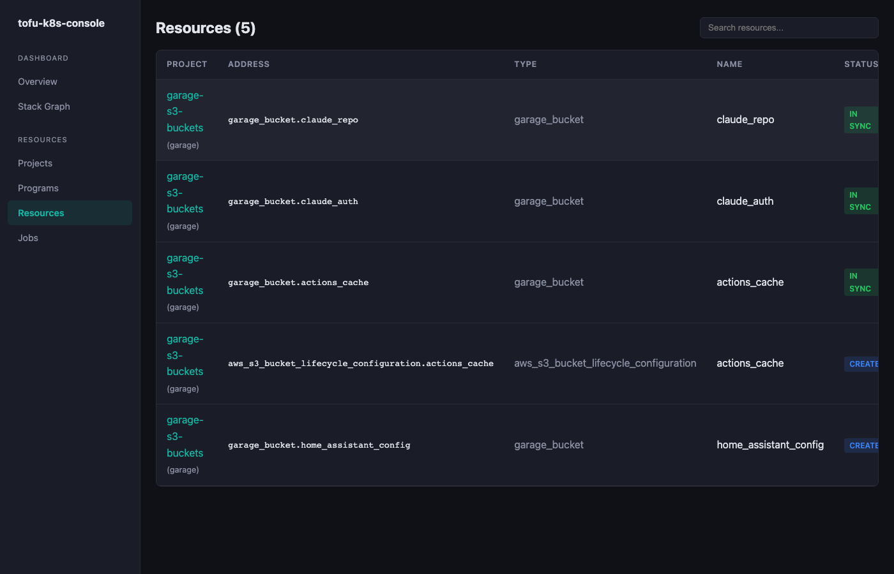
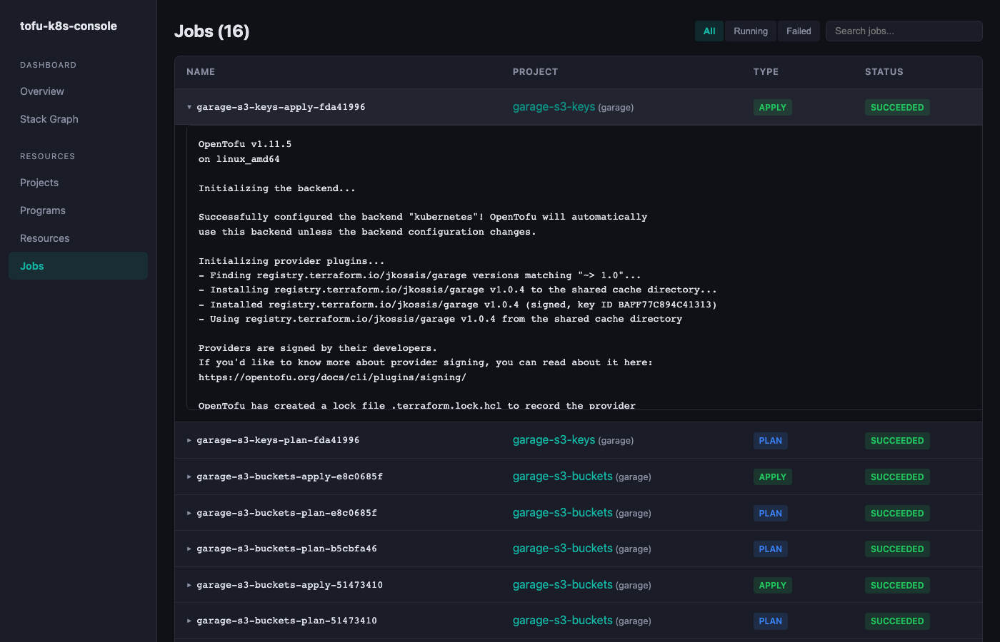
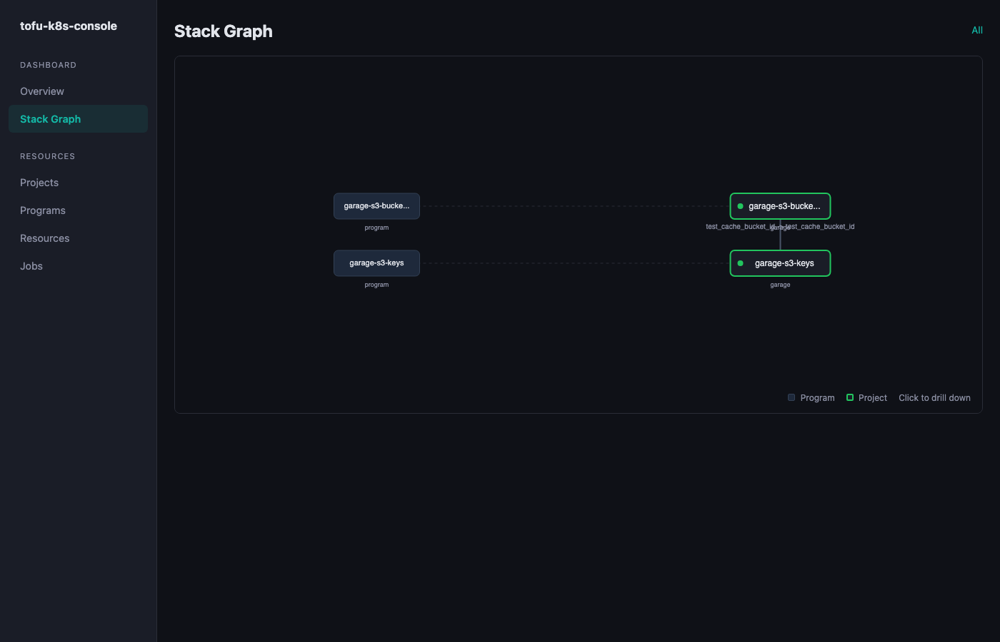
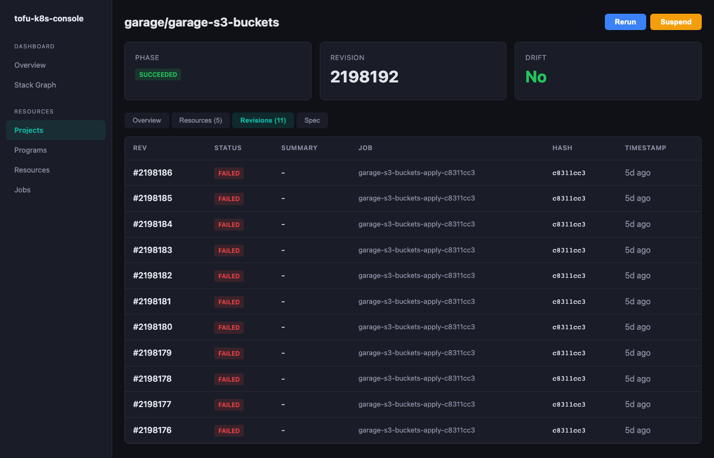
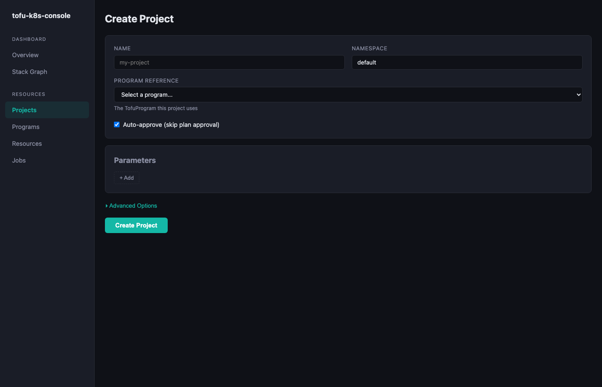
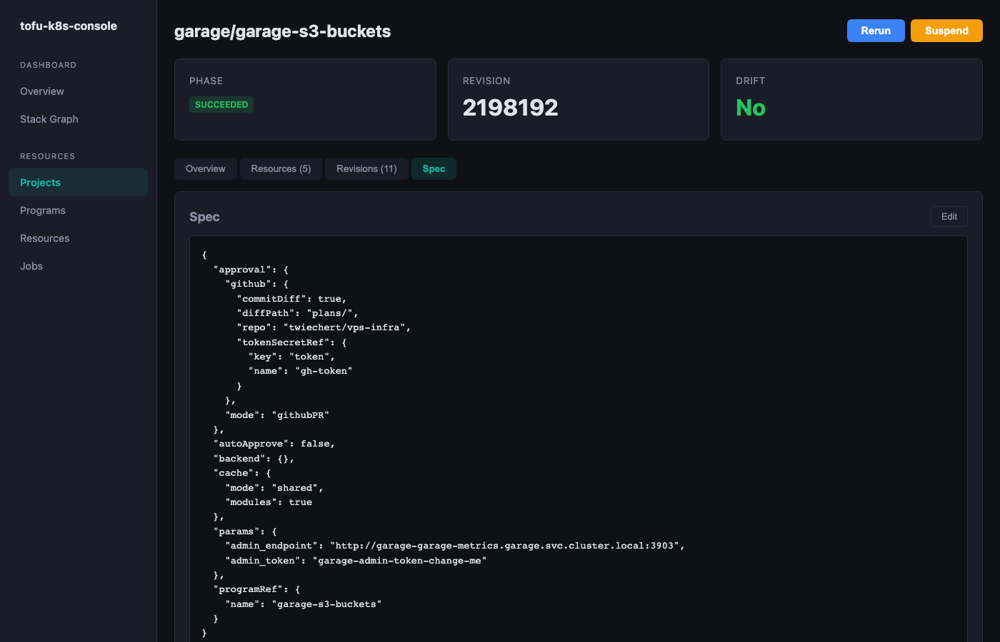

<p align="center">
  
  <br/>
  <strong>tofu-k8s-console</strong>
  <br/>
  <em>Web console for the <a href="https://github.com/twiechert/tofu-k8s-operator">tofu-k8s-operator</a> — manage OpenTofu/Terraform workloads on Kubernetes.</em>
</p>

<p align="center">
  <a href="https://github.com/twiechert/tofu-k8s-console/actions/workflows/ci.yaml"></a>
  <a href="https://github.com/twiechert/tofu-k8s-console/releases/latest"></a>
  <a href="https://github.com/twiechert/tofu-k8s-console/blob/main/LICENSE"></a>
</p>

## Screenshots

| Overview | Projects | Project Detail |
|----------|----------|----------------|
|  |  |  |

| Resources | Jobs & Logs | Stack Graph |
|-----------|-------------|-------------|
|  |  |  |

| Revisions | Create Project | Spec Editor |
|-----------|----------------|-------------|
|  |  |  |

## Features

- **Overview** — aggregate stats, phase breakdown, error/drift counts
- **Projects** — list, search, detail view with plan output, outputs, blast radius
- **Programs** — list all TofuProgram resources
- **Resources** — view managed infrastructure resources parsed from plan output
- **Jobs** — running and completed jobs with duration tracking and expandable logs
- **Revisions** — full audit trail per project with snapshot files
- **Stack Graph** — interactive dependency graph with drill-down (namespace -> project -> detail)
- **Actions** — approve plans, rerun, suspend/resume, edit spec, delete directly from the UI
- **CRUD** — create, edit, and delete projects and programs from the UI

## Quick Start

```bash
# Build and run locally (uses current kubecontext)
just run

# Or build manually
cd web && npm install && npm run build && cd ..
go build -o bin/tofu-k8s-console ./cmd/server/
./bin/tofu-k8s-console
```

Open [http://localhost:8090](http://localhost:8090).

## Development

```bash
# Run backend (API on :8090)
just dev-api

# Run frontend dev server with hot reload (proxies API to :8090)
just dev-web
```

## Helm

```bash
helm install tofu-k8s-console oci://ghcr.io/twiechert/charts/tofu-k8s-console \
  --namespace tofu-system
```

## Architecture

Single Go binary with embedded React SPA. Connects to the Kubernetes API using in-cluster config or kubeconfig to read TofuProject/TofuProgram CRDs, revision ConfigMaps, and Jobs.

```
Browser → Go HTTP server → Kubernetes API
              ↓
         Embedded React SPA (Vite + TypeScript)
```

## Related

- [tofu-k8s-operator](https://github.com/twiechert/tofu-k8s-operator) — the operator this console manages
- [Documentation](https://tofu-k8s-operator.readthedocs.io) — full operator docs
